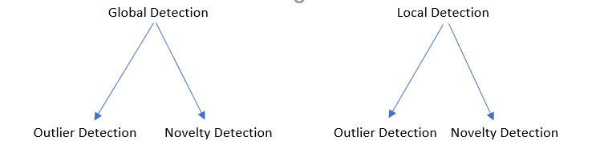
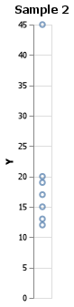
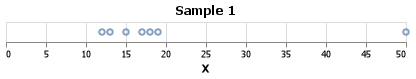
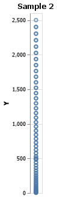
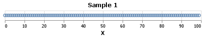
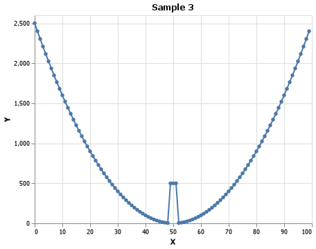
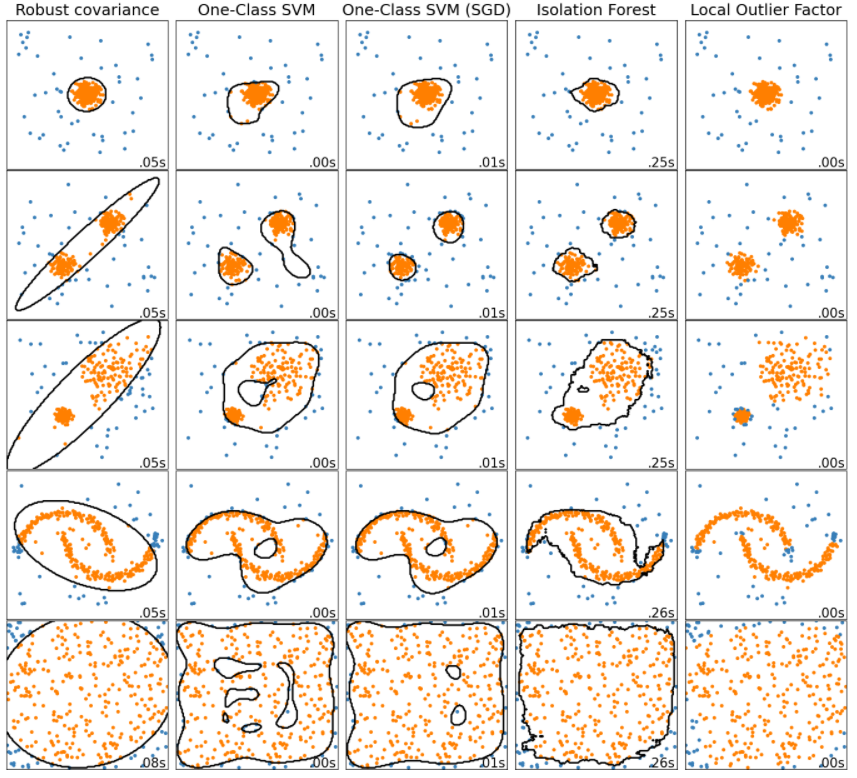

# Ben Fuqua Senior Project
## Outlier Detection Methods
This repository will hold all of the various research materials, links, code chunks, and programs developed during my senior project

## Organization
You will find 2 folders within the main page of the repo. The first one being for global methods and the second being about local methods. Each folder will have a README page that describes what is within that folder, links to articles found on various methods, and python scripts that will have code examples of the various methods.

This README will have links to general notes about outlier detection methods and hold my timeline for the project
## Time Line
Week 1: Project Definition
Weeks 2-4: Research Global and local outlier detection models
Week 5-7: Finish up research on various methods/organize information
Week 8-10: Start the recommendation program
Week 11-12: Start making presentation and finish up program
Week 13: Final preparation and presentation

## General Notes

#### Brief Overview
- Outlier 
    - The training data contains outliers which are defined as observations that are far from the others. 
    - Outlier detection estimators thus try to fit the regions where the training data is the most concentrated, ignoring the deviant observations.
    - Unsupervised anomaly detection
    - cannot form dense cluster/assumption is they are located in low density regions.
    
- Novelty
    - The training data is not polluted by outliers and we are interested in detecting whether a new observation is an outlier. 
    - In this context an outlier is also called a novelty.
    - Semi-supervised anomaly detection.
    - Possible to form dense cluster, but must be in a low density region of the training data.

#### Strategy Implementation
The scikit-learn project provides a set of machine learning tools that can be used for both novelty and outlier detection. 
- Outlier detection occurs in the `estimator.fit(X_train)
- Novelty detection occurs in the `estimator.predict(X_test)
- Inliers are labeled '1'
- Outliers are labeled '-1'

The predict method makes use of a threshold on the raw scoring function respective to the estimator. This function is accessible through the score_samples method, and the threshold is controlled by the contamination parameter. 
The decision_function method is also defined from the scoring function, in such a way that negative values are outliers and non-negative ones are inliers

**Special Note**: Local Outlier FActor does not support predict, decision function, and score_samples methods but only a fit_predict method, as this estimator was originally meant to be applied for outlier detection(not outlier and novelty). You can access the individual scores through the negative_outlier_factor_ attribute. If you really want to use this estimator for novelty detection, you can instantiate the estimator with the novelty parameter = True, but in this case fit_predict is not available. When set to true, you must only use predict and score_samples on new unseen data or else you will get incorrect scores.

# Detection Types
In this section we will cover 2 groups of 2 types of outlier detection. These two groups form a type of hierarchy that is as follows:

#### Novelty Detection
Consider a sample with *n* observations (rows) and *p* features (columns). If we add another observation, how do we know if it is regular? (i.e. does it come from the same distribution?) Novelty detection addresses this question

Simply put, it is about to learn a threshold of the initial observation's distribution, plotted in *p*-dimensional space. Then, if our observation lies within the threshold, we assume they come from the same population (distribution). Else, we can say they are abnormal with a given confidence in our assessment

#### Outlier Detection
Similar in goal to Novelty Detection, the goal is to separate a core of regular observations from polluting ones, called outliers. Yet, in the case of outlier detection, we don't have a clean data set representing the population of regular observations that can be used to train any tool.

#### Global Detection
A global outlier is when a specific point has a higher measured value than the other points in the dataset. For example, if 3 points had values of 300, 400, and 350 respectively, and the 4th point had a value of 750 the 4th point would be considered a global outlier. It is very easy to find outliers within 1 dimension of data. The two graphs below come from the same dataset. We are looking at a line plot of the x axis and y axis. It isn't hard to see which point would be considered a global outlier.

#### Local Detection
Local detection is when a point has a value that falls into the normal range, but is erroneous when compared to the other values in it's cluster. For example, if 6 points of a valley were measured to be 200m, 100m, 150m, 85m, 150m and 200m a local outlier detection method would flag the first 150m. But why? We have another 150m measurement within the dataset, so how can the classifier do this? Well, to start, local detection can sometimes be identified within a univariate analysis, but is most often identified within a multivariate analysis. The first two graphs below are line plots from the same dataset. When only taking into consideration 1 dimension of data, it is difficult to tell which one is considered an outlier. But, when the 2 dimensions are combined, the outliers are revealed. I know this is an extremely uniform dataset, but I wanted to make it painfully obvious to drive home the point.

#### Overview of Models
There are 5 main models found within the SciKit-Learn python package. Robust Covariance, Once-Class SVM, One-Class SVM (SGD), Isolation Forest and Local Outlier Factor. The code used to generate this plot below can be found on SciKit-Learn's [website](https://scikit-learn.org/stable/auto_examples/miscellaneous/plot_anomaly_comparison.html).

Below is an image found at the afore mentioned site,

As you can see, some models perform better when given a unimodal dataset vs multimodal dataset. EX: Dataset 1 & 2 when comparing Isolation Forest and Robust Covariance.

I will dive deeper into these models in the 'Global_Methods' folder and 'Local Methods' folder.

# Appendix: Links

[Overview of various models](https://scikit-learn.org/stable/modules/outlier_detection.html)
- Click on the picture and names of the estimators to learn specific information about them. 
