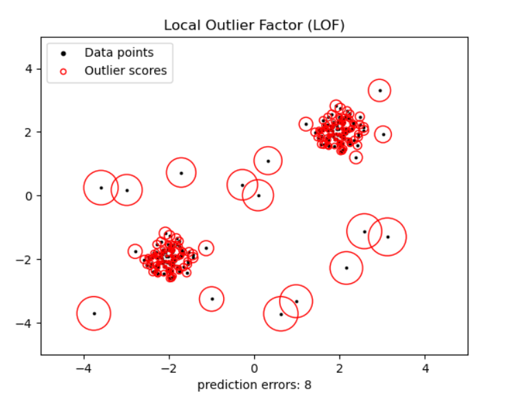

# Local Outlier Factor (LOF)
- Unsupervised Outlier Detection
- This algorithm focuses on an anomaly score vs classification
- measures local deviation of the density for a given sample with respect to neighbors
- By comparing the local density of a sample to the local densities of its neighbors, one can identify samples that have a substantially lower density than their neighbors.

## Example

It considers as outliers the samples that have a substantially lower density than their neighbors.The number of neighbors considered (parameter n_neighbors) is typically set 1) greater than the minimum number of samples a cluster has to contain, so that other samples can be local outliers relative to this cluster, and 2) smaller than the maximum number of close by samples that can potentially be local outliers. In practice, such information is generally not available, and taking n_neighbors=20 appears to work well in general.

## Parameters:
- n_neighbors, default = 20: number of points to consider when looking at local densities 
- leaf_size: Passed to ball and kdt methods. When to switch to brute force search algorithm
- metric: distance metric to be used
- p: if metric is left to default (minkowski); 1 = manhattan 2 = euclidean
- contamination: the proportion of outliers in the data set. This is used when fitting the threshold of the model. (0,.5]
- Novelty: normally LOF isn't used for novelty detection, but if you want to, only use decision_function, predict and score_samples on new unseen data. 